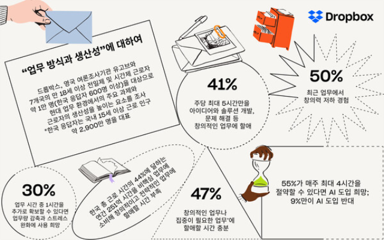
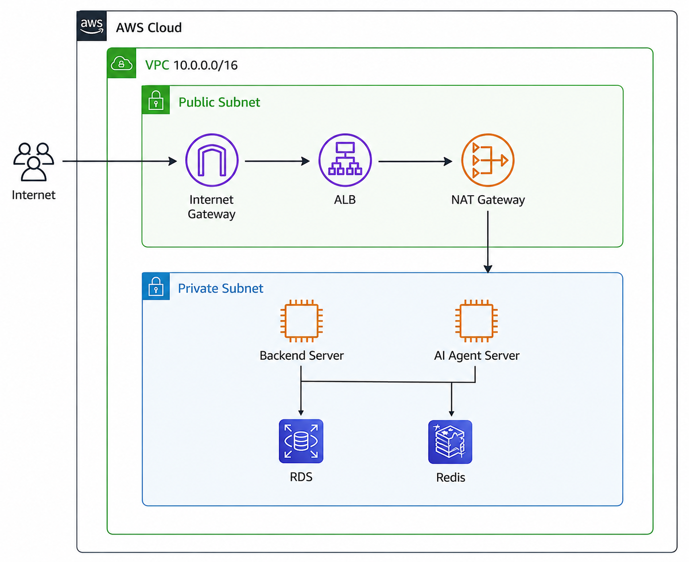
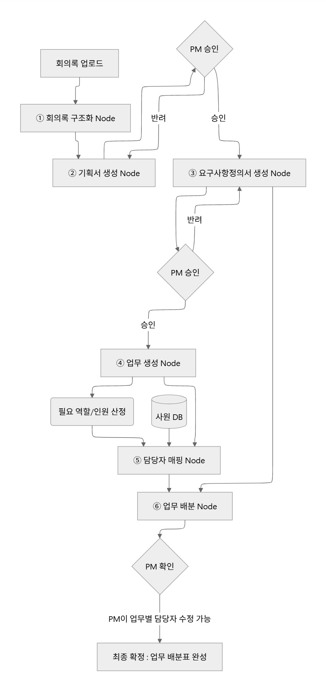

# 헤이,짜비(SKN31기 Final 1팀)

## 목차

* [팀원 소개](#팀원-소개)
* [WBS](#WBS)
* [기술스택](#기술스택)
* [디렉토리 구조](#디렉토리-구조)
* [프로젝트 소개](#프로젝트-소개)

### 팀원 소개
<div align="center">
<table align="center">
  <tr>
    <td align="center" width="190px"></td>
    <td align="center" width="190px"></td>
    <td align="center" width="190px"></td>
    <td align="center" width="190px"></td>
    <td align="center" width="190px"></td>
  </tr>
  <tr>
    <td align="center"><b>박연아(PM)</b></td>
    <td align="center"><b>이재일</b></td>
    <td align="center"><b>김가율</b></td>
    <td align="center"><b>김재원</b></td>
    <td align="center"><b>박하린</b></td>
  </tr>
    <tr>
    <td align="center">AI agent</td>
    <td align="center">DB, AWS</td>
    <td align="center">Django <br> 백엔드</td>
    <td align="center">React <br> 프론트엔드</td>
    <td align="center">AI agent</td>
  </tr>

  <tr>
    <td align="center"><a href="https://github.com/yeona9549"></a></td>
    <td align="center"><a href="https://github.com/qufdlfkd88"></a></td>
    <td align="center"><a href="https://github.com/Kim-gayul"></a></td>
    <td align="center"><a href="https://github.com/kimjae9360"></a></td>
    <td align="center"><a href="https://github.com/MintRinne"></a></td>
  </tr>
  
</table>

</div>

<br>

## 기술스택

#### Frontend


 
#### Backend


 
#### AI 


#### Database


 
#### Infrastructure & DevOps


---
<br>

## 디렉토리 구조
````
SKN31-FINAL-1Team/
├── ai/               # LLM 기반 AI 에이전트 파이프라인
├── backend/          # Django REST API 서버
├── frontend/         # Next.js 웹 클라이언트
├── infra/            # 인프라 코드 
├── data/             # 데이터 저장용 
├── API.yaml          # API 명세 (OpenAPI/Swagger)
└── requirements.txt
````
<br>


## 1. 프로젝트 소개

### 1.1 프로젝트 주제  
- <b>프로젝트 명: 헤이,짜비(Hey Zzabi)</b>
- 개발 프로젝트를 진행하는 과정에서 <b>팀장이 반복적으로 수행하는 기획서 작성·요구사항 정의·업무 배분을 AI가 자동으로 지원하는</b> 스마트 그룹웨어입니다.


### 1.3 프로젝트 기획 배경
<div align="center">

</div>
<br>

- 현대의 업무 환경에서는 정보 검색, 자료 관리, 보고서 작성 등 **반복적인 행정 업무에 많은 시간이 소요**되고 있습니다.

- **드롭박스·유고브(2025)**: 국내 근로 시간의 약 **절반(연간 251억 시간)**이 행정·반복 업무에 소요되며, **68%**가 주당 최대 10시간을 단순 업무에 사용
- **인크루트(2025)**: 직장인의 **30.1%**가 회의 문화를 비효율적으로 평가하며, 주요 원인으로 **목적·결론 부재(52.7%)** 등을 지적
특히 회의 후 **회의록 정리 → 결정사항 문서화 → 업무 배분** 등의 작업이 수작업으로 이루어져 팀장·관리자의 업무 부담이 증가하고 있습니다.

- 이에 **회의 내용을 AI가 분석하고 문서화 및 업무 배분까지 자동화하는 시스템**을 통해 반복 업무를 줄이고, 업무 실행력을 높이고자 기획하게 되었습니다.

<br>

### 1.4 프로젝트 목표

"회의 한 건으로 시작되는 스마트 AI 그룹웨어 파이프라인 구축"

#### - 단일 파이프라인(End-to-End) 구축
회의록 입력부터 **안건 구조화 → 기획서·요구사항 정의서 초안 생성 → 업무 도출 및 담당자 추천**까지 하나의 워크플로우로 자동화합니다.

#### - 사람 중심의 통제와 설명 가능한 AI
 AI가 생성한 문서와 업무 배분안을 **팀장이 직접 승인·반려**할 수 있도록 하며, 담당자 추천 근거와 답변의 출처를 제공하여 **AI 의사결정의 신뢰성과 투명성**을 확보합니다.

#### - 팀 생산성 향상 및 지식 자산화
회의록 작성과 업무 배분에 소요되는 반복 업무를 줄여 **팀원이 핵심 개발 업무에 집중**할 수 있도록 합니다. 또한 회의 및 업무 이력을 DB에 축적하여 **조직의 지식 자산화와 신규 팀원의 빠른 온보딩**을 지원합니다.

<br>

<br>


## 2. 시장 기회 및 차별화 전략


기존 협업툴은 메신저, 화상회의, 파일 공유, 프로젝트 및 업무 관리 등 다양한 협업 기능을 제공하며 조직 내 커뮤니케이션과 정보 공유를 지원합니다. Enterprise Collaboration Market 역시 프로젝트 관리, 통합 메시징, 파일 공유, 비즈니스 프로세스 관리 등의 영역을 포함하고 있습니다. 

하지만 회의에서 결정된 내용을 실제 업무로 연결하기 위해서는 여전히 사용자가 여러 단계를 직접 처리해야 합니다.
<br>
<br>

### 2-1. 기존 협업툴과의 차별화

기존 협업툴은 메신저, 문서, 프로젝트 및 업무 관리 등 **협업에 필요한 기능을 제공하는 것**에 초점을 둡니다.

반면 **헤이 짜비는 회의에서 생성된 정보를 다음 업무 단계의 입력으로 활용하여, 개발팀의 업무 프로세스를 연결하고 자동화**하는 것을 목표로 합니다.

| 구분 | 기존 협업툴 | 헤이 짜비 |
|---|---|---|
| 회의 | 회의록 작성·공유 | AI 기반 회의 내용 구조화 |
| 문서 | 사용자가 직접 작성 | 회의 내용을 기반으로 기획서 생성 |
| 요구사항 | 별도 작성·관리 | 기획서를 기반으로 요구사항 생성 |
| 업무 | 사용자가 직접 등록 | 요구사항을 기반으로 업무 생성 |
| 담당자 | 사용자가 직접 지정 | 업무 특성을 기반으로 담당자 추천·배분 |
| 핵심 방식 | **기능 중심의 협업 지원** | **단계 간 정보 연결 및 업무 자동화** |


### 2-2. 핵심 차별화 포인트

**① 회의 중심의 업무 연결**

회의를 단순 기록의 시작점으로 사용하지 않고, 회의에서 결정된 내용을 이후 산출물 생성의 입력으로 활용합니다.


**② 단계별 AI 에이전트 파이프라인**

하나의 AI가 모든 작업을 처리하는 방식이 아니라, **회의 분석 → 기획 → 요구사항/WBS → 업무 생성 → 업무 배분**을 단계별 에이전트로 구성합니다.

각 에이전트는 이전 단계의 결과물을 입력으로 받아 자신의 역할을 수행하고, **생성된 결과를 다음 단계로 전달하는 파이프라인 구조**로 설계했습니다.


**③ 사람의 검토를 포함한 자동화**

모든 과정을 AI에게 맡기는 방식이 아니라, 주요 산출물 사이에 **사람의 검토 및 승인 과정**을 포함합니다.

AI가 생성한 결과를 사람이 확인하고 승인한 후 다음 단계로 전달하며, 수정이 필요한 경우 **사람이 직접 수정하거나 재생성을 요청할 수 있도록 구성**합니다.


## AWS 아키텍처

<div align="center">

</div>
<br>

## AI Agent Flow

<div align="center">

</div>

<br>

<br>

## 주요 기능

| 기능 | 주요 내용 | PM 지원 효과 |
|---|---|---|
| **회의록 AI 구조화** | 회의록을 분석하여 프로젝트, 사용자, 요구사항, 시나리오, 결정사항 등의 정보로 구조화 | 회의 내용 정리 및 핵심 정보 추출 자동화 |
| **기획서 자동 생성** | 구조화된 회의 데이터를 기반으로 기획서 자동 생성 | 반복적인 기획 문서 작성 부담 감소 |
| **PM 검토 및 승인** | AI가 생성한 기획서를 PM이 검토하고 승인·반려·수정 | AI 결과에 대한 PM의 검토 및 통제 |
| **요구사항 정의서 자동 생성** | 승인된 기획서를 기반으로 요구사항 정의서 자동 생성 | 요구사항 정리 및 문서 작성 업무 지원 |
| **업무 자동 생성** | 확정된 요구사항을 분석하여 개발에 필요한 업무 자동 생성 | 업무 단위 정의 및 등록 업무 감소 |
| **담당자 자동 매칭** | 업무에 필요한 역할·인원과 사원 DB의 정보를 기반으로 적합한 담당자 매칭 | 업무별 담당자 선정 부담 감소 |
| **업무 자동 배분** | 매칭된 담당자를 기반으로 업무를 자동 배분 | 반복적인 업무 배분 작업 자동화 |
| **최종 업무 검토** | PM이 업무별 담당자를 확인하고 필요 시 직접 수정 후 최종 확정 | PM의 최종 의사결정 및 업무 통제 |

<br>

<br>

## 데이터 수집 및 활용

| 데이터명 | 수집 대상 | 수집 목적 | 사용 예정 기능 | 출처 / 저작권 |
|---|---|---|---|---|
| 사원 정보 데이터 | 팀원 인적사항, 보유 기술, 자격증 | AI 담당자 추천 시 참조할 인력 프로필 구성 | 담당자 추천, 업무 배분 자동화 | Faker(`ko_KR`) 기반 자체 생성 |
| 회의록 데이터 | 회의 내용 및 회의 기록 | 회의 내용을 근거로 한 기획서 자동 생성 시 참조 데이터 확보 | 회의록 자동 요약, 액션아이템 추출 | LLM API(Claude/GPT) 기반 합성 데이터 생성 |
| 기획서, 요구사항정의서 데이터 | 프로젝트 기획 문서 및 요구사항 목록 | 문서 기반 AI 분석 및 추천 기능 검증 | 요구사항 분석, 산출물 검토 지원 | LLM API 기반 합성 데이터 생성 |
<br>

<br>

## 화면설계


