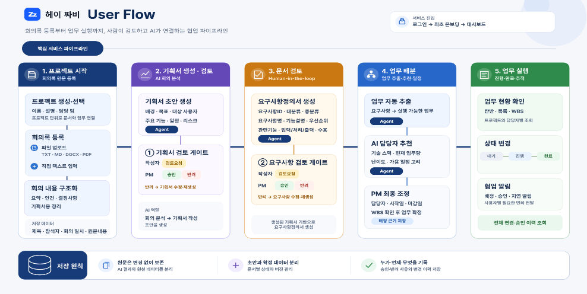

# 헤이,짜비(SKN31기 Final 1팀)

## 목차

* [팀원 소개](#팀원-소개)
* [WBS](#WBS)
* [기술스택](#기술스택)
* [디렉토리 구조](#디렉토리-구조)
* [프로젝트 소개](#프로젝트-소개)

### 팀원 소개
<div align="center">
<table align="center">
  <tr>
    <td align="center" width="190px"></td>
    <td align="center" width="190px"></td>
    <td align="center" width="190px"></td>
    <td align="center" width="190px"></td>
    <td align="center" width="190px"></td>
  </tr>
  <tr>
    <td align="center"><b>박연아(PM)</b></td>
    <td align="center"><b>이재일</b></td>
    <td align="center"><b>김가율</b></td>
    <td align="center"><b>김재원</b></td>
    <td align="center"><b>박하린</b></td>
  </tr>
    <tr>
    <td align="center">AI agent</td>
    <td align="center">DB, AWS</td>
    <td align="center">Django <br> 백엔드</td>
    <td align="center">React <br> 프론트엔드</td>
    <td align="center">AI agent</td>
  </tr>

  <tr>
    <td align="center"><a href="https://github.com/yeona9549"></a></td>
    <td align="center"><a href="https://github.com/qufdlfkd88"></a></td>
    <td align="center"><a href="https://github.com/Kim-gayul"></a></td>
    <td align="center"><a href="https://github.com/kimjae9360"></a></td>
    <td align="center"><a href="https://github.com/MintRinne"></a></td>
  </tr>
  
</table>

</div>

<br>

## 기술스택

#### Frontend


 
#### Backend


 
#### AI 


#### Database


 
#### Infrastructure & DevOps


---
<br>

## 디렉토리 구조
````
SKN31-FINAL-1Team/
├── ai/               # LLM 기반 AI 에이전트 파이프라인
├── backend/          # Django REST API 서버
├── frontend/         # Next.js 웹 클라이언트
├── infra/            # 인프라 코드 
├── data/             # 데이터 저장용 
├── API.yaml          # API 명세 (OpenAPI/Swagger)
└── requirements.txt
````
<br>


## 1. 프로젝트 소개

### 1.1 프로젝트 주제  
- <b>프로젝트 명: 헤이,짜비(Hey Zzabi)</b>
- 개발 프로젝트를 진행하는 과정에서 <b>팀장이 반복적으로 수행하는 기획서 작성·요구사항 정의·업무 배분을 AI가 자동으로 지원하는</b> 스마트 그룹웨어입니다.


### 1.3 프로젝트 기획 배경
<div align="center">

</div>
<br>

- 현대의 업무 환경에서는 정보 검색, 자료 관리, 보고서 작성 등 **반복적인 행정 업무에 많은 시간이 소요**되고 있습니다.

- **드롭박스·유고브(2025)**: 국내 근로 시간의 약 **절반(연간 251억 시간)**이 행정·반복 업무에 소요되며, **68%**가 주당 최대 10시간을 단순 업무에 사용
- **인크루트(2025)**: 직장인의 **30.1%**가 회의 문화를 비효율적으로 평가하며, 주요 원인으로 **목적·결론 부재(52.7%)** 등을 지적
특히 회의 후 **회의록 정리 → 결정사항 문서화 → 업무 배분** 등의 작업이 수작업으로 이루어져 팀장·관리자의 업무 부담이 증가하고 있습니다.

- 이에 **회의 내용을 AI가 분석하고 문서화 및 업무 배분까지 자동화하는 시스템**을 통해 반복 업무를 줄이고, 업무 실행력을 높이고자 기획하게 되었습니다.

<br>

### 1.4 프로젝트 목표
<div align="center">

</div>

#### 단일 파이프라인(End-to-End) 구축
- 회의록 입력부터 **안건 구조화 → 기획서·요구사항 정의서 초안 생성 → 업무 도출 및 담당자 추천**까지 하나의 워크플로우로 자동화합니다.

#### 사람 중심의 통제와 설명 가능한 AI
- AI가 생성한 문서와 업무 배분안을 **팀장이 직접 승인·반려**할 수 있도록 하며, 담당자 추천 근거와 답변의 출처를 제공하여 **AI 의사결정의 신뢰성과 투명성**을 확보합니다.

#### 팀 생산성 향상 및 지식 자산화
- 회의록 작성과 업무 배분에 소요되는 반복 업무를 줄여 **팀원이 핵심 개발 업무에 집중**할 수 있도록 합니다. 또한 회의 및 업무 이력을 DB에 축적하여 **조직의 지식 자산화와 신규 팀원의 빠른 온보딩**을 지원합니다.

<br>

## AWS 아키텍처

<div align="center">

</div>
<br>

## AI Agent Flow

<div align="center">

</div>


## 주요기능

## 수집 데이터

## 화면설계


