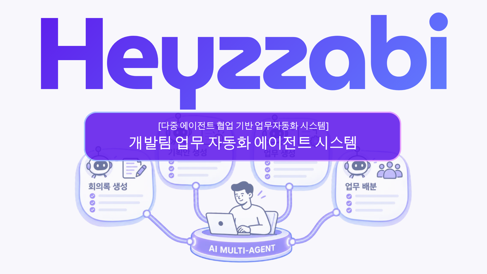
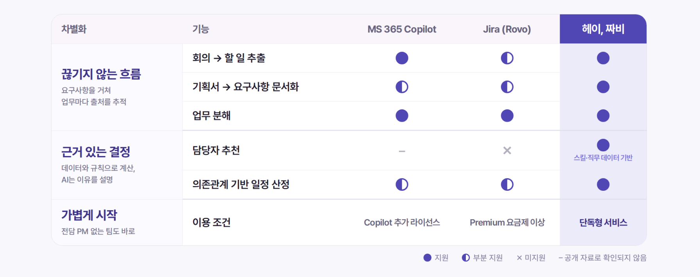
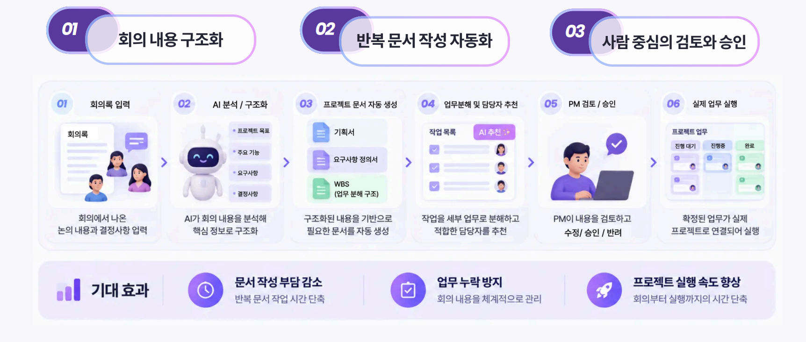
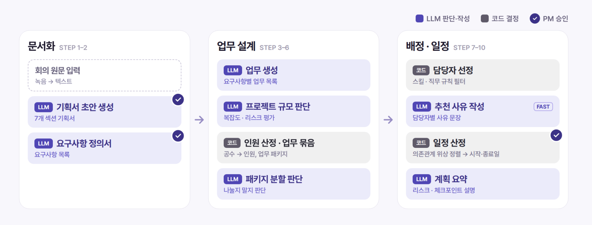
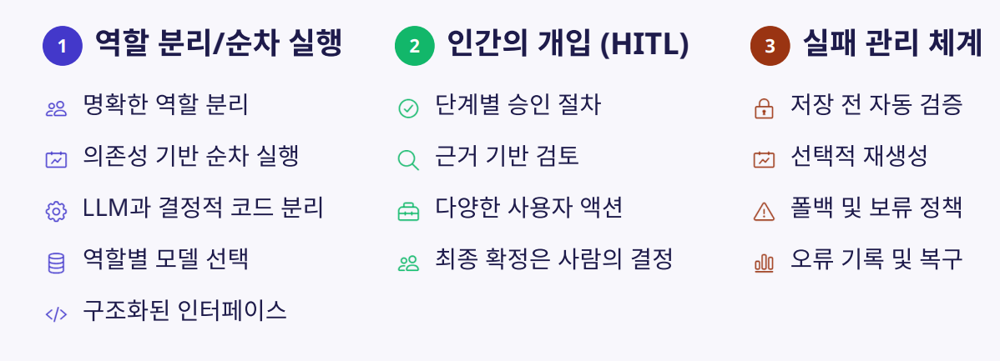
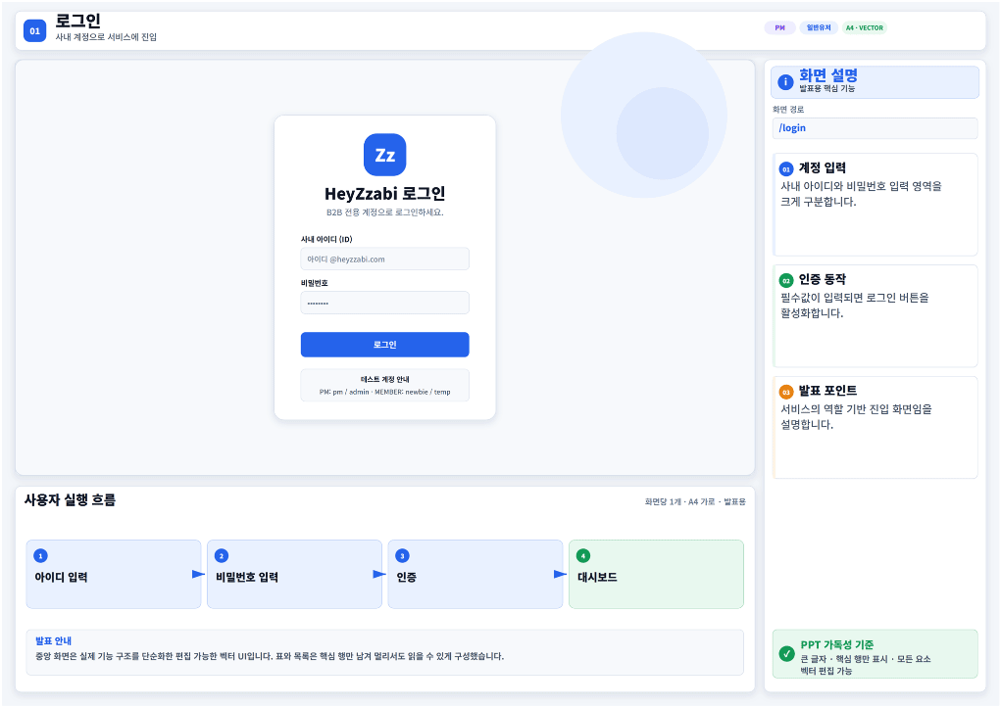

## SKN31 Final 1Team
<div align="center">

</div>

<br>

## 📌 목차
1. [팀원 소개 및 역할](#1-팀원-소개-및-역할)
2. [프로젝트 소개](#2-프로젝트-소개)
3. [기술 스택 및 인프라](#3-기술-스택-및-인프라)
4. [시스템 & AI 아키텍처](#4-시스템--ai-아키텍처)
5. [핵심 기능 및 멀티 에이전트 파이프라인](#5-핵심-기능-및-멀티-에이전트-파이프라인)
6. [핵심 설계 원칙 & 신뢰성 장치](#6-핵심-설계-원칙--신뢰성-장치)
7. [데이터 수집 및 활용](#7-데이터-수집-및-활용)
8. [화면설계](#8-화면설계)
9. [프로젝트 디렉토리 구조](#9-프로젝트-디렉토리-구조)
10. [회고](#10-회고)
11. [실행 방법](#11-실행-방법)

<br>

## 1. 팀원 소개 및 역할

<div align="center">

| **박연아** | **김가율** | **김재원** | **이재일** | **박하린** |
| :---: | :---: | :---: | :---: | :---: |
|  |  |  |  |  |
| **PM & AI Agent** | **Backend** | **Frontend** | **DB & DevOps** | **AI Agent** |
| [](https://github.com/yeona9549) | [](https://github.com/Kim-gayul) | [](https://github.com/kimjae9360) | [](https://github.com/qufdlfkd88) | [](https://github.com/MintRinne) |

</div>
<br>

## 2. 프로젝트 소개

### 💡 기획 배경
- **개발팀 PM의 업무 병목**: 회의 종료 후 회의록 정리, 기획서 작성, 요구사항 정의, 업무 분해, 담당자 배정, 일정 산정까지 수많은 후속 조율 작업이 PM 1명에게 집중되는 구조적 한계가 존재합니다.
- **반복되는 문서화와 정보 분산**: 한국 직장인의 66%가 정기 보고서 및 정리 업무에 시간을 소모하고, 87%는 업무 조율 여력 부족을 겪고 있습니다.
- **핵심 목표**: "회의 한 번으로 시작되는 승인형 AI 워크플로우!"  
  정리는 AI 에이전트에게 맡기고, PM은 **검토와 승인(Human-in-the-Loop)** 에만 집중하여 업무 효율과 정확도를 크게 향상시킵니다.

### 🌟 차별화 포인트
<div align="center">

</div>

- **끊기지 않는 업무 흐름**: 회의 녹음 → 기획서 → 요구사항 정의서 → 업무 생성 → 담당자 배정/일정 산정까지 단계별 출처 추적 지원
- **근거 있는 AI 결정**: 스킬·숙련도·가용일 데이터와 명확한 정량적 공식으로 담당자를 추천하고 이유를 설명
- **단독형 및 승인 중심 구조**: 거대한 엔터프라이즈 라이선스(MS Copilot 등) 없이도 가볍게 도입 가능한 단독형 서비스

<br>

## 3. 기술 스택 및 인프라

| 분류 | 사용 기술 및 도구 |
| :--- | :--- |
| **Frontend** |   (Vercel 배포, Route Handler 프록시, HttpOnly 쿠키 인증) |
| **Backend** |      (AWS EC2 Ubuntu) |
| **Database** |   |
| **AI & LLM** |  `gpt-5` (기본 모델), `gpt-transcribe` (음성 전사),  (호출 추적 및 관측) |
| **Domain & Network** | DuckDNS, Nginx Reverse Proxy (HTTPS), CORS/CSRF 보호, Vercel 4.5MB 제한 우회용 음성 직접 전송 |

<br>

## 4. 시스템 아키텍처

### 🏗️ 전체 시스템 구조
<div align="center">

</div>

1. **Next.js (Vercel)**: 사용자의 요청을 Same-origin Route Handler로 프록시하여 서드파티 쿠키 CORS 문제 회피. (단, 음성 파일은 4.5MB 제한 우회를 위해 백엔드로 직접 전송)
2. **Django + Nginx (AWS EC2)**: HttpOnly JWT 토큰 기반 인증 및 권한 제어(PM 그룹 관리). 비동기 작업 스레드 생성 후 `202 Accepted + job_id` 즉시 응답.
3. **비동기 폴링 (Task & Job Table)**: 프론트엔드가 작업 상태(`RUNNING` $\rightarrow$ `SUCCESS`/`ERROR`)를 주기적으로 폴링하여 현재 단계를 UI에 반영.
4. **AWS RDS (MySQL)**: `meeting_note`, `spec_document`, `requirement_definition`, `task_assignment`, `pipeline_history`, `*_job` 등 관리.

<br>

## 5. 핵심 기능 및 멀티 에이전트 흐름도

체계적인 3단계 10-Step 에이전트 흐름으로 구성됩니다.

<div align="center">

</div>

<div align="center">

</div>

### 📄 STEP 1~2: 문서화 단계
- **기획서 생성**: 회의 원문을 요약 없이 그대로 읽고 **[맥락 섹션]**과 **[기술·결정 섹션]**을 두 개의 LLM 호출로 병렬 처리. 인용 검증 모듈이 회의록 원문 대조 통과 여부 검증 후 7개 섹션 작성.
- **요구사항 정의서 생성**: 승인된 기획서를 기반으로 기능(FR) 및 비기능(NFR: 보안·신뢰성·성능) 요구사항 자동 추출. 누락 검사를 통해 최대 3회 자동 재요청.

### ⚙️ STEP 3~6: 업무 설계 단계 (백그라운드)
- **업무 생성 (Epic > Task > Subtask)**: 요구사항별 업무 및 공수(시간), 난이도, 리스크 버퍼, 필요 스킬 정의.
- **규모 판단 & 인원 산정**: 기획서의 난이도(하·중·상)에 따라 버퍼(0~30%)를 가산하고, 역할별 총 공수 계산식을 통해 인원 산정 및 업무 패키지 묶음 생성.
- **패키지 분할 판단**: FAST LLM이 1인 가용시간 초과 및 역할 혼합 여부를 판단하여 분할안 적용.

### 👥 STEP 7~10: 배정 & 일정 단계 (백그라운드)
- **후보 필터링 & 경력 적합도**: 사원 DB에서 재직 여부 및 스킬 일치 후보를 추출 후 FAST LLM이 경력기술서 원문과 실제 업무 대조 (0~1점 산출).
- **담당자 배정 (코드 정량 공식)**:  
  $$\text{Score} = (0.40 \times \text{스킬 적합도}) + (0.25 \times \text{경력/자격증}) + (0.15 \times \text{잔여 여유율}) + (0.20 \times \text{동일 기능 보너스})$$
  *※ LLM은 배정 결정을 직접 하지 않고, 확정된 배정에 대해 3문장의 추천 사유 작성만 담당합니다.*
- **일정 산정 (결정적 스케줄러)**: 선행 업무 의존관계(위상 정렬)에 따라 하루 6시간 기준 주말 제외 시작/종료일 자동 산정.
- **계획 브리핑**: 리스크 요약(2~4개) 및 체크포인트를 정리하여 PM 검토 화면에 제공.

<br>

## 6. 핵심 설계 원칙 & 신뢰성 장치

AI의 환각(Hallucination) 및 오작동을 방지하고 서비스 신뢰성을 확보하기 위한 **13가지 핵심 장치**를 적용했습니다.

<div align="center">

</div>

1. **역할 분리 및 순차 실행**: LLM 판단과 코드의 정량 계산을 철저히 분리 (담당자/일정 수치는 100% 코드가 결정).
2. **인간 중심 통제 (Human-in-the-Loop)**: 주요 산출물(기획서, 요구사항, 최종 배분) 사이마다 PM 승인 절차 배치. 반려 시 사유를 포함하여 선택적 재생성.
3. **실패 관리 체계**:
   - 저장 전 인용 대조 및 구조 자동 검증
   - 누락 및 이상 발생 시 빠진 항목만 최대 3회 재요청
   - LLM 판단 실패 시 코드 기반 기본 규칙으로 자동 풀백(Fallback)
   - 파이프라인 오류 이력 상세 기록 및 복구 지원

<br>

## 7. 데이터 수집 및 활용

| 데이터명 | 수집 대상 | 수집 목적 | 사용 예정 기능 | 출처 / 저작권 |
|---|---|---|---|---|
| 사원 정보 데이터 | 팀원 인적사항, 보유 기술, 자격증 | AI 담당자 추천 시 참조할 인력 프로필 구성 | 담당자 추천, 업무 배분 자동화 | Faker(`ko_KR`) 기반 자체 생성 |
| 회의록 데이터 | 회의 내용 및 회의 기록 | 회의 내용을 근거로 한 기획서 자동 생성 시 참조 데이터 확보 | 회의록 자동 요약, 액션아이템 추출 | LLM API(Claude/GPT) 기반 합성 데이터 생성 |
| 기획서, 요구사항정의서 데이터 | 프로젝트 기획 문서 및 요구사항 목록 | 문서 기반 AI 분석 및 추천 기능 검증 | 요구사항 분석, 산출물 검토 지원 | LLM API 기반 합성 데이터 생성 |
<br>

## 8. 화면설계

<p align="center">
  
</p>

<br>

## 9. 프로젝트 디렉토리 구조

```
Heyzzabi/
├── ai/                     # LLM 기반 AI 에이전트 파이프라인 패키지
│   ├── prompts/            # 에이전트별 YAML 프롬프트 (context, technical_decisions 등)
│   ├── validators/         # 원문 인용 검증 및 누락 검사 모듈
│   └── pipeline/           # Step 1~10 비동기 실행 파이프라인
├── backend/                # Django REST Framework 백엔드
│   ├── apps/               # meeting_note, spec_document, task 등 서비스 레이어
│   ├── config/             # Nginx, Gunicorn, JWT, CORS 설정
│   └── jobs/               # 비동기 스레드 작업 상태 관리 (*_job)
├── frontend/               # Next.js App Router 프론트엔드
│   ├── app/                # Route Handler (/api/*) 및 페이지 UI
│   └── hooks/              # TanStack Query 기반 상태 관리 및 상태 폴링
└── 산출물/                 # 프로젝트 산출물
```

<br>

## 10. 회고
| 팀원 | 한 줄 회고 |
| :---: | :--- |
| **박연아** | |
| **김가율** | |
| **김재원** | |
| **이재일** | |
| **박하린** | |

<br>

## 11. 실행 방법
### 💡프론트엔드
```
1. 프론트엔드 폴더로 이동
`cd frontend`

2. 어떤 npm을 사용 중인지 확인
`which npm`

* 출력 결과가 /mnt/c/Program Files/... 처럼 /mnt/c/로 시작한다면 Windows용 패키지가 리눅스 환경에서 억지로 실행되면서 경로 충돌을 일으키고 있는 상태

3. 리눅스 자체에 Node.js를 설치
* NVM(Node 버전 관리자) 설치
`curl -o- https://raw.githubusercontent.com/nvm-sh/nvm/v0.40.1/install.sh | bash`
* 환경 변수 즉시 적용
`source ~/.bashrc`
* 리눅스용 Node.js(LTS 버전) 설치
`nvm install --lts`
4. 설치 확인 및 기존 node_modules 재설치
* 설치가 끝난 후 아래 명령어를 실행해 경로가 /home/playdata/...로 바꼈는지 확인
`which npm`
5. 기존 찌꺼기 파일 삭제
`rm -rf node_modules package-lock.json`
6. 패키지 재설치
`npm install`
7. 서버 실행(기본 포트 3000)
`npm run dev`
8. 웹 실행
`http://localhost:3000`
```
*  최초실행 완료 후에는 7,8번만 실행하면 됨.
---
### 💡백엔드

* 새로운 터미널에서 실행

1) 터미널에서 다음 명령어 순차적으로 실행
```powershell
cd backend
uv venv .venv --python=3.13
.venv\Scripts\activate
uv pip install -r requirements.txt
copy .env.example .env

1-1) 아래 코드 실행하여 django secret key 생성한 후 복사하여 env에 붙여넣기

python -c "from django.core.management.utils import get_random_secret_key; print(get_random_secret_key())"

2) env 파일 내 key 값 채우기

SECRET_KEY=<<본인 django API key 입력>>
OPENAI_API_KEY=<<본인 API key 입력>>

3) python manage.py runserver
