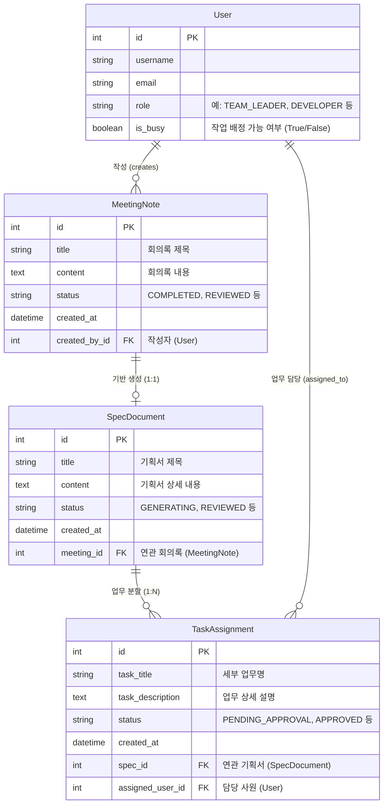

# 개발부서 팀장 업무 대시보드 백엔드 개발 및 프로젝트 진행 가이드

본 문서는 개발부서 팀장을 위한 **회의록 작성 자동화 - 기획서 작성 자동화 - 업무 배분 자동화** 시스템의 백엔드 개발 및 전체 프로젝트 진행 방법을 단계별로 정리한 가이드입니다.

---

## 1. 시스템 아키텍처 및 데이터 흐름 설계

팀장의 승인/검토 단계(Human-in-the-loop)를 거쳐 다음 파이프라인 API가 체인 형태로 호출되는 구조입니다. 데이터의 일관성과 작업 상태 관리를 위한 비동기 파이프라인과 상태 머신(State Machine) 설계가 핵심입니다.

## 🔄 업무 처리 워크플로우 (Workflow)

```mermaid
flowchart LR
    %% 노드 스타일 정의
    classDef process fill:#ffffff,stroke:#333333,stroke-width:2px,color:#000000;
    classDef gate fill:#e6f0ff,stroke:#2b6cb0,stroke-width:2px,color:#1a365d;

    %% 1행 워크플로우
    N1["<b>직원설정</b><br/><sub style='color:#666;'>직원 테이블</sub>"]:::process
    N2["<b>음성 문서</b><br/><sub style='color:#666;'>자동화<br/>회의록 관리 테이블</sub>"]:::process
    G1(("<b>승인</b>")):::gate
    N3["<b>기획서</b><br/><sub style='color:#666;'>AI 변환<br/>기획서 관리 테이블</sub>"]:::process
    G2(("<b>승인 (1차)</b>")):::gate

    %% 2행 워크플로우
    N4["<b>업무배분</b><br/><sub style='color:#666;'>AI 배분<br/>직원관리/기획서 테이블 참고</sub>"]:::process
    G3(("<b>승인 (팀개입)</b>")):::gate
    N5["<b>직원 업무할당</b><br/><sub style='color:#666;'>마감 임박 시 일정 수정 가능<br/>팀장 알림 기능</sub><br/><span style='color:#e53e3e; font-size:11px;'>⚠️ 취소 시도 시 에러 메시지</span>"]:::process
    N6["<b>업무추적</b><br/><sub style='color:#666;'>프로젝트 테이블 참고<br/>업무배분확정/직원관리 테이블</sub>"]:::process

    %% 연결 관계
    N1 --> N2
    N2 --> G1
    G1 --> N3
    N3 --> G2
    G2 --> N4
    N4 --> G3
    G3 -- "업무배분 테이블 참고" --> N5
    N5 --> N6

    %% 반려 / 취소 분기 (에러 방지를 위해 linkStyle 대신 인라인 스타일 연결 지정)
    G3 == "반려/취소" ==> N4
```

---

## 2. 백엔드 개발 단계별 진행 가이드

### 1단계: DB 스키마 설계 및 엔티티 구축
파이프라인 간 데이터 연동과 사원 상태 관리를 위한 데이터베이스 구조를 정의합니다.

* **User (사원/팀장 테이블)**
  * `id`, `name`, `email`, `role` (LEADER / MEMBER)
  * `is_busy` (BOOLEAN: 현재 작업 중 여부) 또는 `active_task_count`
* **MeetingNote (회의록 테이블)**
  * `id`, `title`, `content`, `status` (`DRAFT`, `REVIEWED`)
  * `created_by`, `created_at`, `updated_at`
* **SpecDocument (기획서 테이블)**
  * `id`, `meeting_id` (FK)
  * `title`, `summary`, `file_path`, `status` (`GENERATING`, `COMPLETED`, `REVIEWED`)
  * `created_at`
* **TaskAssignment (업무 배분 테이블)**
  * `id`, `spec_id` (FK), `assigned_user_id` (FK)
  * `task_title`, `task_description`, `status` (`PENDING_APPROVAL`, `APPROVED`)
  * `created_at`

### 2단계: 핵심 API 파이프라인 개발

#### ① 회의록 API & 기획서 생성 요청
* `POST /api/v1/meetings`: 회의록 저장/수정
* `POST /api/v1/meetings/{id}/review-complete`: **회의록 검토 완료 API**
  * 회의록 상태를 `REVIEWED`로 변경.
  * 내부적으로 **기획서 작성 API/서비스(LLM/AI 연동)**를 비동기(Background Task / Queue)로 호출.
  * 기획서 상태 레코드 생성 (`status: GENERATING`).

#### ② 기획서 관리 API & 업무 배분 요청
* `GET /api/v1/specs/{id}` & `GET /api/v1/specs/{id}/download`: 기획서 조회 및 다운로드
* `POST /api/v1/specs/{id}/review-complete`: **기획서 검토 완료 API**
  * 기획서 상태를 `REVIEWED`로 변경.
  * **업무 배분 알고리즘 API** 호출.
  * 작업 가능 사원 목록(`is_busy == False`) 및 기획서 항목을 바탕으로 추천 업무 배분안 생성 (`status: PENDING_APPROVAL`).

#### ③ 업무 배분 및 알림 API
* `GET /api/v1/assignments/recommendation`: 산출된 업무 배분안 조회 (팀장 확인용)
* `POST /api/v1/assignments/approve`: **팀장 승인 및 개별 알림 API**
  * **작업중인 사원 제외 필터링**: `User.is_busy == False` 조건을 DB에서 재검증.
  * 업무 배분 확정 (`status: APPROVED`).
  * **알림 API 요청**: 대상 사원들에게 개별 알림 전송 (WebSocket, Slack Webhook, Email 등).

---

## 3. 전체 프로젝트 단계별 진행 로드맵

1. **1단계: 환경 설정 및 DB 스키마 구축**
   * 백엔드 프레임워크 선택 (FastAPI, Spring Boot, Node.js 등).
   * DB 테이블(User, Meeting, Spec, Task) 및 사원의 작업 상태(Idle/Busy) 필드 설계.
   * LLM/AI 서비스 연동 모듈 기초 설계.

2. **2단계: 회의록 및 기획서 자동화 파이프라인 구현**
   * 회의록 CRUD 및 '검토 완료' 엔드포인트 작성.
   * 회의록 데이터 기반 기획서 자동 생성 백그라운드 작업(Worker/Queue) 연동.
   * 기획서 파일 저장(S3 또는 로컬 Storage) 및 다운로드 API 구현.

3. **3단계: 업무 배분 알고리즘 및 알림 모듈 구현**
   * 사원 상태(`is_busy`) 조회 필터링 로직 구현.
   * 기획서 항목을 파싱하여 작업 가능한 사원에게 매핑하는 로직 구축.
   * 팀장 승인 시 해당 사원에게 전송할 알림 서비스(Slack / Web Push / Email) API 연동.

4. **4단계: 프론트엔드 연동 및 대시보드 UI 개발**
   * **1 화면 (회의록)**: 작성/수정 UI 및 `[검토 완료]` 버튼 연동.
   * **2 화면 (기획서)**: 생성 상태 플래그 확인, `[다운로드]` 및 `[검토 완료]` 버튼 연동.
   * **3 화면 (업무 배분)**: 작업 가능 사원 목록 표시, 추천 배분안 확인/수정 UI, `[승인 및 알림 발송]` 버튼 연동.

5. **5단계: E2E 테스트 및 예외 처리**
   * 기획서 생성 지연 시 프론트엔드 상태 처리(Polling 또는 WebSocket).
   * 업무 배분 대상 사원이 없을 경우 예외 처리.
   * 전체 자동화 파이프라인 통합 테스트 수행.

---

## 4. 핵심 고려 사항

1. **비동기 작업 처리 (Async Task)**
   * 회의록 $\rightarrow$ 기획서 생성 과정에서 AI API 연동 시 소요 시간이 발생하므로, HTTP 요청을 블로킹하지 않고 Celery, BullMQ, FastAPI BackgroundTasks 등을 활용해 비동기로 처리하는 것이 좋습니다.
2. **사원 상태 관리 (Busy Check)**
   * '작업 중인 사원 제외' 조건의 기준(진행 중인 티켓 존재 여부, 휴가 여부 등)을 DB Query 레벨에서 명확히 정의해야 합니다.
3. **알림 전송 타겟팅**
   * 승인 이벤트 발행 시 개별 사원 ID 기반으로 타겟팅된 알림이 누락 없이 전달되도록 큐(Queue) 구조를 고려하면 안정적입니다.

## 5. 테이블 현황

---

### 🔍 테이블 간 주요 관계 요약

1. **`User` $\leftrightarrow$ `MeetingNote` (1:N)**
   * 한 명의 팀장/유저(`User`)가 여러 개의 회의록(`MeetingNote`)을 작성할 수 있습니다.
2. **`MeetingNote` $\leftrightarrow$ `SpecDocument` (1:1 또는 1:N)**
   * 검토 완료된 하나의 회의록(`MeetingNote`)을 바탕으로 기획서(`SpecDocument`)가 생성됩니다.
3. **`SpecDocument` $\leftrightarrow$ `TaskAssignment` (1:N)**
   * 작성 완료된 하나의 기획서(`SpecDocument`)로부터 여러 개의 세부 개발 업무(`TaskAssignment`)가 추출 및 배정됩니다.
4. **`User` $\leftrightarrow$ `TaskAssignment` (1:N)**
   * 한 명의 사원(`User`)은 여러 개의 업무(`TaskAssignment`)를 배정받아 처리할 수 있으며, 배정 시 `is_busy` 상태 값이 업데이트됩니다.