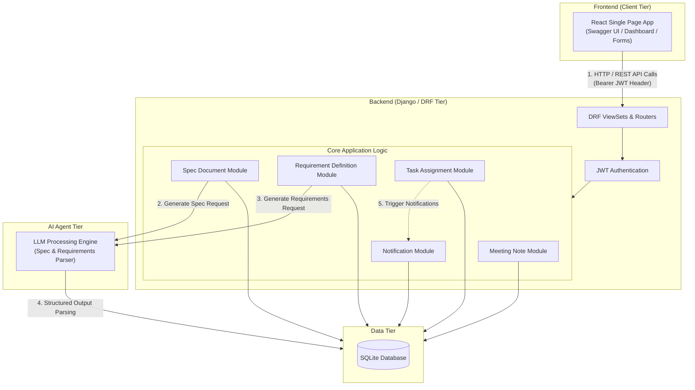
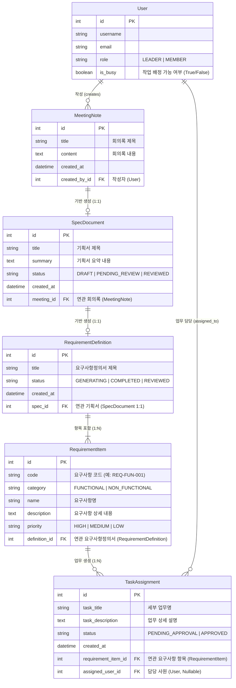

# 개발부서 업무 대시보드 백엔드 개발 및 프로젝트 진행

본 문서는 개발부서 사원을 위한 **회의록 작성 자동화 - 기획서 작성 자동화 - 요구사항 정의서 작성 자동화 - 업무 배분 자동화** 시스템의 백엔드 개발 및 전체 프로젝트 진행 방법을 단계별로 정리한 문서입니다.

---

## 1. 시스템 아키텍처 및 데이터 흐름 설계

팀장의 승인/검토 단계(Human-in-the-loop)를 거쳐 다음 파이프라인 API가 체인 형태로 호출되는 구조입니다. 데이터의 일관성과 작업 상태 관리를 위한 비동기 파이프라인과 상태 머신(State Machine) 설계가 핵심입니다.

---
### * 전체 아키텍처



### * 계층별 주요 역할

* **Frontend (React)**
  * **API 연동 & JWT 처리**: REST API 호출 시 `Authorization: Bearer <token>` 헤더를 포함하여 요청을 전송합니다.
  * **사용자 권한별 인터페이스 제공**: 일반 회원(`MEMBER`)과 팀장(`LEADER`) 권한에 맞춰 버튼 활성화 및 액션(검토 요청, 검토 완료, 최종 승인)을 제어합니다.
  * **수동 조정 UI**: 팀장이 자동 배정된 업무의 담당자 이름을 클릭하면 팀원 목록(드롭다운)이 표시되고, 수동 변경 API를 호출할 수 있는 인터페이스를 제공합니다.

* **Backend (Django REST Framework)**
  * **ViewSets & Serializers**: 엔드포인트 라우팅, 요청 데이터 검증 및 `drf-spectacular` 기반 Swagger 문서화를 자동 생성합니다.
  * **비즈니스 로직 및 트랜잭션 관리**: 파이프라인 단계별 상태 변경을 처리하며, `transaction.atomic()`을 적용해 LLM 연동, 데이터 저장, 알림 발송 간 일관성을 유지합니다.
  * **권한 검증**: 요청자의 역할을 검증하여 팀장 전용 기능(`review-complete`, `approve-all`)에 대한 접근을 제어합니다.

* **AI Agent Tier**
  * **기획서 자동 생성 모듈**: 작성된 회의록(`MeetingNote`) 데이터를 분석하여 구조화된 기획서(`SpecDocument`) 본문 및 요약을 생성합니다.
  * **요구사항 추출 모듈**: 검토 완료된 기획서를 파싱하여 기능/비기능 항목으로 분형화하고 개별 요구사항(`RequirementItem`) 객체로 생성합니다.

* **Data Tier (SQLite)**
  * **데이터 영속성 관리**: 회의록, 기획서, 요구사항, 업무 배정, 회원 및 알림 데이터를 저장하고 관리합니다.
  * **상태 흐름 보장**: `Status` 필드를 통해 각 엔티티의 진행 상태(`DRAFT` ➔ `PENDING_REVIEW` ➔ `REVIEWED` 및 `PENDING_APPROVAL` ➔ `APPROVED`)를 추적합니다.

---

## 2. 백엔드 개발 단계별 진행

### 1단계: DB 스키마 설계 및 엔티티 구축
파이프라인 간 데이터 연동과 사원 상태 관리를 위한 데이터베이스 구조를 정의합니다.(임시)

* **User (사원/팀장 테이블)**
  * `id`, `user_id`, `username`, `email`
  * `role` (`LEADER` / `MEMBER`)
  * `is_busy` (BOOLEAN: 현재 작업 수행 중 여부)

* **MeetingNote (회의록 테이블)**
  * `id`, `title`, `content`
  * `created_by` (FK -> User), `created_at`, `updated_at`

* **SpecDocument (기획서 테이블)**
  * `id`, `meeting_id` (FK -> MeetingNote)
  * `title`, `summary`, `file_path`
  * `status` (`DRAFT`, `PENDING_REVIEW`, `REVIEWED`)
  * `created_at`

* **RequirementDefinition (요구사항정의서 테이블 - 신규 추가)**
  * `id`, `spec_id` (1:1 FK -> SpecDocument)
  * `title`, `status` (`GENERATING`, `COMPLETED`, `REVIEWED`)
  * `created_at`

* **RequirementItem (세부 요구사항 항목 테이블 - 신규 추가)**
  * `id`, `definition_id` (FK -> RequirementDefinition)
  * `code` (예: `REQ-FUN-001`)
  * `category` (`FUNCTIONAL` / `NON_FUNCTIONAL`)
  * `name`, `description`, `priority` (`HIGH`, `MEDIUM`, `LOW`)

* **TaskAssignment (업무 배분 테이블)**
  * `id`, `requirement_item_id` (FK -> RequirementItem)
  * `assigned_user` (FK -> User, Nullable - 수동 변경 지원)
  * `task_title`, `task_description`
  * `status` (`PENDING_APPROVAL`, `APPROVED`)
  * `created_at`

### 2단계: 핵심 API 파이프라인 개발

| 순서 | 주체 | 화면 동작 / 이벤트 | 호출 API | 주요 처리 내용 |
| :--- | :--- | :--- | :--- | :--- |
| **1** | Member, Leader | 회의록 작성 | `POST /api/v1/meetings/` | 회의록 DB 저장 |
| **2** | Member, Leader | '기획서 생성' 버튼 클릭 | `POST /api/v1/specs/generate/` | LLM Agent 호출 ➔ `SpecDocument` 자동 생성 |
| **3** | Member, Leader | 기획서 화면 확인/검토 | `GET /api/v1/specs/{id}/` | 생성된 기획서 데이터 조회 |
| **4** | Member | '기획서 검토 요청' 버튼 클릭 | `PATCH /api/v1/specs/{id}/request-review/` | 기획서 상태를 `PENDING_REVIEW`로 변경 |
| **5** | Member, Leader | 기획서 화면 확인/검토 | `GET /api/v1/specs/{id}/` | 검토 요청된 기획서 상세 조회 |
| **6** | Leader | '기획서 검토완료' 버튼 클릭 | `POST /api/v1/specs/{id}/review-complete/` | 기획서 상태를 `REVIEWED`로 변경 |
| **7** | Member, Leader | '요구사항정의서 생성' 버튼 클릭 | `POST /api/v1/requirements/generate/` | LLM Agent 호출 ➔ `RequirementDefinition` 및 `Item` 생성 |
| **8** | Member, Leader | 요구사항정의서 화면 확인/검토 | `GET /api/v1/requirements/{id}/` | 추출된 기능/비기능 요구사항 목록 조회 |
| **9** | Leader | '업무배분' 버튼 클릭 | `POST /api/v1/tasks/auto-assign/` | `RequirementItem` 기반으로 `PENDING_APPROVAL` 상태의 Task 자동 생성 |
| **10** | Member, Leader | 업무 배정 목록 확인/검토 | `GET /api/v1/tasks/pending/` | 승인 대기 중인 업무 배정 목록 조회 |
| **11** | Leader | 담당자 변경 (드롭다운) | `PATCH /api/v1/tasks/{id}/` | 특정 Task의 `assigned_user` 필드 수동 수정 |
| **12** | Leader | '업무 배정 최종 승인' 버튼 클릭 | `POST /api/v1/tasks/approve-all/` | Task 상태 `APPROVED` 변경, 담당자 `is_busy=True` 업데이트 및 알림 발송 |

### * 단계별 핵심 구현 포인트

#### 1. 요구사항정의서 Agent 연동 (7번 단계)
* **LLM 파싱**: 기획서(`SpecDocument`) 본문을 분석하여 개별 기능/비기능 요구사항(`RequirementItem`)으로 분형화합니다.
* **독립 실행**: 기획서 검토 완료(`REVIEWED`) 후 팀장 또는 팀원이 직접 '요구사항정의서 생성' 버튼을 누를 때 별도 API로 구동됩니다.

#### 2. 업무 자동 배분: 임시 상태 생성 (9번 단계)
* `POST /api/v1/tasks/auto-assign/` 호출 시 생성되는 모든 `TaskAssignment` 레코드는 **`status = 'PENDING_APPROVAL'`** 상태로 DB에 저장됩니다.
* 이 시점에는 **자동 승인이 이루어지지 않으며**, 담당 사원의 `is_busy` 상태를 변경하거나 알림을 전송하지 않습니다.

#### 3. 팀장의 담당자 수동 조정 권한 (11번 단계)
* 프론트엔드에서 팀장은 승인 대기 중인 Task의 담당자 이름을 클릭하여 팀원 목록(드롭다운) 중 원하는 담당자로 변경할 수 있습니다.
* 이때 백엔드는 `PATCH /api/v1/tasks/{task_id}/` 요청을 받아 `{ "assigned_user": user_id }` 필드만 부분 업데이트 처리합니다.

#### 4. 최종 승인 및 상태 업데이트 (12번 단계)
* 팀장이 '업무 배정 최종 승인' 버튼을 누르면 `POST /api/v1/tasks/approve-all/`이 실행됩니다.
* **트랜잭션(`transaction.atomic`) 처리**:
  1. `PENDING_APPROVAL` 상태인 대상 Task들을 일괄 **`APPROVED`** 로 변경합니다.
  2. 최종 할당된 담당 사원들의 **`is_busy = True`** 로 업데이트합니다.
  3. 담당 사원들에게 개별 **알림(Notification)** 을 발송합니다.

---

## 3. 전체 프로젝트 단계별 진행 로드맵

### 1단계: 개발 환경 구성 및 DB 스키마/인증 구축
* **DRF & JWT 설정**: Django REST Framework 환경 구축 및 JWT 기반 사용자 인증/권한 체계 적용.
   - Django는 화면을 전혀 만들지 않고 순수 데이터(JSON)만 제공하며, 화면(UI)은 React(Frontend)가 전담하여 그리는 탈중앙화(Decoupled) 구조.
* **DB 모델링**: 데이터 모델 구축 (`User`, `MeetingNote`, `SpecDocument`, `RequirementDefinition`, `RequirementItem`, `TaskAssignment`).
* **API 문서화**: `drf-spectacular`를 활용한 OpenAPI 3.0 기반 Swagger UI 자동화 설정.

### 2단계: 문서 자동화 AI 파이프라인 구현 (기획서 & 요구사항정의서)
* **회의록 & 기획서 생성**: 회의록 CRUD 및 LLM Agent 연동을 통한 기획서 자동 생성 API (`POST /api/v1/specs/generate/`).
* **기획서 검토 워크플로우**: 기획서 검토 요청 (`PATCH /api/v1/specs/{id}/request-review/`) 및 팀장 검토 완료 (`POST /api/v1/specs/{id}/review-complete/`) 로직 작성.
* **요구사항정의서 생성 Agent**: 검토 완료된 기획서 파싱 ➔ 기능/비기능 요구사항(`RequirementItem`) 자동 추출 및 DB 저장 API (`POST /api/v1/requirements/generate/`).

### 3단계: 업무 자동 배분 및 수동 조정/승인 로직 구현
* **임시 업무 배분 생성**: `RequirementItem` 기반 업무 자동 분할 ➔ 승인 대기 (`PENDING_APPROVAL`) 상태의 Task 생성 API (`POST /api/v1/tasks/auto-assign/`).
* **팀장 담당자 수동 조정**: 팀장에 의한 특정 Task 담당자 변경 부분 업데이트 API (`PATCH /api/v1/tasks/{id}/`).
* **최종 승인 및 트랜잭션 처리**: `transaction.atomic()` 기반의 일괄 승인 API (`POST /api/v1/tasks/approve-all/`) ➔ Task 상태 `APPROVED` 변경, 사원 `is_busy=True` 전환, 알림 서비스 연동.

### 4단계: React 프론트엔드 연동 및 대시보드 UI 개발
* **1 화면 (회의록)**: 회의록 작성/수정 UI 및 `[기획서 생성]` 버튼 연동.
* **2 화면 (기획서)**: 생성된 기획서 확인, `[기획서 검토 요청]` (Member), `[기획서 검토 완료]` (Leader) 버튼 연동.
* **3 화면 (요구사항정의서)**: `[요구사항정의서 생성]` 버튼 연동 및 추출된 기능/비기능 요구사항 목록 표(Table) UI 구현.
* **4 화면 (업무 배분)**: `[업무배분]` 버튼 연동, 승인 대기 목록 UI, 담당자 변경 드롭다운 UI, `[업무 배정 최종 승인]` 버튼 연동.

### 5단계: 파이프라인 예외 처리 및 통합 E2E 테스트
* **AI Agent 예외 처리**: LLM 응답 지연, 파싱 실패 시 예외 처리 및 데이터 복구 로직 강화.
* **리소스 부재 예외 처리**: 작업 가능 사원(`is_busy=False`) 미존재 시 경고 메시지 및 예외 처리.
* **통합 E2E 테스트**: 회의록 작성부터 최종 업무 승인 및 알림 발송까지의 전체 자동화 파이프라인 E2E 검증.

---

## 4. 핵심 고려 사항

1. **비동기 작업 처리 (Async Task & AI Overhead)**
   * 회의록 $\rightarrow$ 기획서 생성 및 기획서 $\rightarrow$ 요구사항정의서 파싱 과정에서 LLM API 호출에 따른 지연시간(Latency)이 발생합니다.
   * Celery/Redis 기반 비동기 워커를 활용하여 HTTP 요청 블로킹을 방지하고, DB 상태 값(`GENERATING` $\rightarrow$ `COMPLETED`) 업데이트를 통해 프론트엔드에서 Polling 처리할 수 있도록 설계합니다.

2. **사원 상태 관리 및 예외 처리 (Busy Check & Allocation Rules)**
   * `is_busy=False`인 작업 가능 사원을 DB Query 레벨(`User.objects.filter(is_busy=False)`)에서 선별합니다.
   * **예외 처리**: 요구사항 항목 수에 비해 작업 가능 사원이 부족할 경우, 시스템이 일괄 할당을 중단하고 경고 메시지를 반환하거나 팀장이 수동 지정할 수 있도록 예외 흐름을 보장합니다.

3. **팀장 수동 변경 및 최종 승인 트랜잭션 (Atomic Transaction)**
   * 팀장의 담당자 수동 변경(`PATCH`) 후 최종 승인(`POST /api/v1/tasks/approve-all/`) 시, Task 상태 변경(`APPROVED`), 담당자 `is_busy=True` 전환, 알림 발송 로직을 **`transaction.atomic()`** 으로 묶어 데이터 무결성을 보장합니다.

4. **알림 전송 타겟팅 및 큐 활용 (Notification Queue)**
   * 최종 승인 이벤트 발생 시 개별 사원 ID 기반으로 알림(Slack / Email / Web Push)이 누락 없이 전송되도록 비동기 메시지 큐 구조를 적용합니다.
---

## 5. 테이블 현황 (Mermaid ERD)


---

## 6. 데이터베이스 전환 (SQLite ➔ MySQL)

### 1. 개요
현재 백엔드 개발은 빠른 프로토타이핑을 위해 임시로 SQLite를 사용 중이나, Django DRF의 ORM(Object-Relational Mapping) 추상화 레이어를 활용하므로 **나중에 MySQL로 전환하더라도 API 엔드포인트 스펙이나 비즈니스 로직을 변경할 필요가 없습니다.**

### 2. 전환 시 체크 및 고려 사항

* **데이터 타입 및 제약조건 엄격성**
  * SQLite와 달리 MySQL은 데이터 타입과 제약조건을 엄격하게 검증합니다.
  * Models 작성 시 `CharField`의 `max_length` 및 `Null/Blank` 속성을 명확히 정의해야 마이그레이션 에러를 방지할 수 있습니다.

* **필수 패키지 설치 및 환경 설정**
  * Django가 MySQL과 연동하기 위한 Python 드라이버 패키지 설치가 필요합니다.
    ```bash
    pip install mysqlclient
    # 또는 pymysql 사용 시: pip install pymysql
    ```

* **마이그레이션(Migration) 초기화 및 적용**
  * MySQL 데이터베이스 구축 완료 후 아래 명령어를 통해 스키마를 새로 생성하고 적용합니다.
    ```bash
    python manage.py makemigrations
    python manage.py migrate
    ```

* **트랜잭션 및 동시성(Concurrency) 보장**
  * SQLite 특유의 File Lock 한계에서 벗어나 MySQL(InnoDB Engine) 전환 시 `transaction.atomic()` 기반의 업무 최종 승인 및 동시성 처리가 훨씬 안정적으로 동작합니다.

### 3. 결론 및 향후 계획
현재 설정된 DB 엔티티 구조(`User`, `MeetingNote`, `SpecDocument`, `RequirementDefinition`, `RequirementItem`, `TaskAssignment`)로 개발을 진행한 뒤, MySQL 환경 구축이 완료되는 시점에 `settings.py`의 `DATABASES` 설정 변경 및 마이그레이션을 통해 손쉽게 이관할 수 있습니다.
