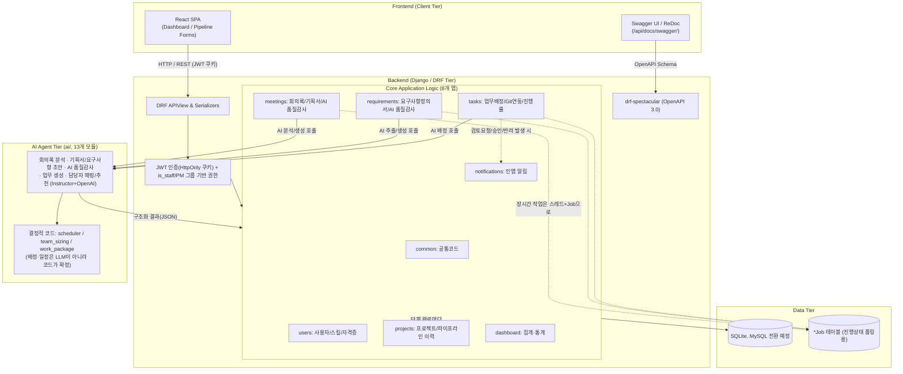
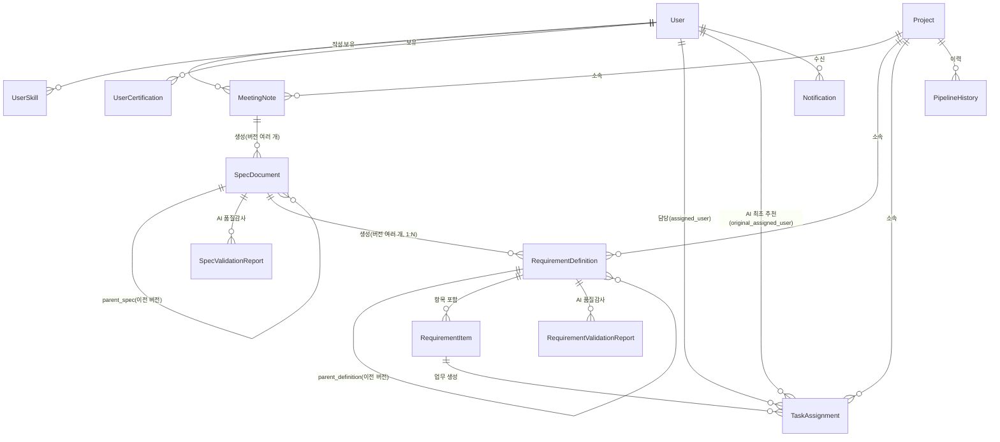

# 개발부서 업무 대시보드 백엔드 — 현재 구현 기준 문서

> 이 문서는 최초 설계안이 아니라 **2026-09-18 기준 실제 코드(models/views/urls)를 스캔해 재작성**한 현황 문서입니다.
> "회의록 작성 → 기획서 생성 → 요구사항정의서 생성 → 업무 자동배분"이라는 큰 골격은 초기 설계와 같지만,
> 상태값 체계·문서 버전관리·AI 품질감사·업무 배정 세부 모듈·비동기 처리 방식은 초기안과 다르게 구현되어 있습니다.

---

## 1. 시스템 아키텍처 및 데이터 흐름


```mermaid
flowchart TB
  subgraph Client ["Frontend (Client Tier)"]
      ReactUI["React SPA<br/>(Dashboard / Pipeline Forms)"]
      SwaggerUI["Swagger UI / ReDoc<br/>(/api/docs/swagger/)"]
  end

  subgraph Backend ["Backend (Django / DRF Tier)"]
      Router["DRF APIView & Serializers"]
      AuthModule["JWT 인증(HttpOnly 쿠키) + is_staff/PM 그룹 기반 권한"]
      DocsEngine["drf-spectacular (OpenAPI 3.0)"]

      subgraph BusinessLogic ["Core Application Logic (8개 앱)"]
          CommonSvc["common: 공통코드"]
          UserSvc["users: 사용자/스킬/자격증"]
          ProjectSvc["projects: 프로젝트/파이프라인 이력"]
          MeetingSvc["meetings: 회의록/기획서/AI 품질감사"]
          ReqSvc["requirements: 요구사항정의서/AI 품질감사"]
          TaskSvc["tasks: 업무배정/Git연동/진행률"]
          NotifSvc["notifications: 인앱 알림"]
          DashSvc["dashboard: 집계·통계"]
      end
  end

  subgraph AI_Engine ["AI Agent Tier (ai/, 13개 모듈)"]
      LLM_Agent["회의록 분석 · 기획서/요구사항 초안 · AI 품질감사<br/>· 업무 생성 · 담당자 매핑/추천 (Instructor+OpenAI)"]
      Scheduler["결정적 코드: scheduler / team_sizing / work_package<br/>(배정·일정은 LLM이 아니라 코드가 확정)"]
  end

  subgraph DataTier ["Data Tier"]
      DB[(SQLite, MySQL 전환 예정)]
      JobTables[("*Job 테이블 (진행상태 폴링용)")]
  end

  ReactUI -->|"HTTP / REST (JWT 쿠키)"| Router
  SwaggerUI -->|"OpenAPI Schema"| DocsEngine
  Router --> AuthModule --> BusinessLogic

  MeetingSvc -->|"AI 분석/생성 호출"| LLM_Agent
  ReqSvc -->|"AI 추출/생성 호출"| LLM_Agent
  TaskSvc -->|"AI 배정 호출"| LLM_Agent
  LLM_Agent --> Scheduler
  LLM_Agent -->|"구조화 결과(JSON)"| BusinessLogic

  MeetingSvc -.->|"장시간 작업은 스레드+Job으로"| JobTables
  ReqSvc -.-> JobTables
  TaskSvc -.-> JobTables

  BusinessLogic --> DB
  TaskSvc -.->|"검토요청/승인/반려 발생 시"| NotifSvc
  BusinessLogic -.->|"단계 완료마다"| ProjectSvc
```

**초기 설계와 달라진 핵심 지점**
- 오케스트레이션은 LangGraph가 아니라 **Django 서비스 레이어의 직접 함수 호출**이다. `ai/graph.py`(LangGraph `StateGraph`)는 실제로는 어디서도 호출되지 않고 import 경로도 깨져 있던 죽은 코드였다(2026-09-18 삭제).
- "비동기 워커(Celery/Redis)"로 설계했으나, **이 프로젝트에 Celery/Redis 인프라가 없다**(requirements.txt에 패키지만 있고 실제 워커 설정 없음). 대신 `threading.Thread` + `*Job` 테이블(상태/진행단계 기록) + 프론트 폴링으로 임시 구현되어 있다.
- 기획서·요구사항정의서 생성 후 사람이 승인/반려하는 흐름 외에, **PM이 별도로 트리거하는 "AI 품질감사" 루프**(검토 리포트 생성 → 점수/재작성안 확인 → 선택 적용 → 새 버전 생성)가 추가되어 있다.

---

## 2. 앱 구조 (8개, 초기 설계엔 6개만 있었음)

```text
backend/
 ├── common/          # 공통 코드 그룹/코드 (CommonCodeGroup, CommonCode)
 ├── users/           # 사용자, 스킬, 자격증, 인증(JWT 쿠키), 계정 관리
 ├── projects/        # Project, PipelineHistory
 ├── meetings/        # MeetingNote, SpecDocument, SpecValidationReport, MeetingAnalysisJob
 ├── requirements/    # RequirementDefinition, RequirementItem, RequirementValidationReport, RequirementExtractionJob
 ├── tasks/           # TaskAssignment, TaskGenerationJob, EmployeeExperienceTagCache
 ├── notifications/   # Notification (인앱 알림) — 초기 설계엔 없던 앱
 └── dashboard/       # 대시보드 집계 API (자체 모델 없음, 다른 앱 데이터 조회) — 초기 설계엔 없던 앱
```

---

## 3. 권한 체계 — 설계 의도와 실제 적용이 다름

- `User.role_code`(CommonCode FK)를 두어 세분화된 권한 코드 체계를 설계했지만, **실제 API 접근 제어는 이 필드를 보지 않는다.** 모든 PM 전용 엔드포인트(`IsPMUser`, `IsOwnerOrPM` 등, `users/permissions.py`)는 Django 내장 `is_staff` 플래그, 보조적으로 `request.user.groups.filter(name='PM')`으로 판정한다.
- 이유는 코드 주석에 명시되어 있다: 기존 계정들의 `role_code` 시드 데이터가 비어 있어(`role_code=None`) 권한 판정에 쓸 수 없고, 프론트엔드 표시용(읽기 전용) 필드로만 노출 중이다(`users/serializers.py`).
- 즉 **"권한 체계 = CommonCode 기반"이라는 설계와 "권한 체계 = Django is_staff/Group 기반"인 실제 구현이 공존**하는 상태다. 정합성을 맞추려면 (a) role_code 시드를 채우고 권한 판정 로직을 옮기거나, (b) role_code를 표시 전용으로 못박고 문서에서 권한 체계는 is_staff/Group이라고 명확히 하는 결정이 필요하다.

---

## 4. 핵심 테이블 (현재 구현 기준 요약 — 전체 필드는 각 앱 `models.py` 참고)

### common
- `CommonCodeGroup`(group_code PK) / `CommonCode`(code_id PK, group FK) — 부서/직무/직급/권한/상태/우선순위/난이도/기술/자격증/업무상태 등 대부분의 enum이 여기로 이관됨. **초기 설계의 TextChoices 방식은 대부분 폐기**.

### users
- `User`(AbstractUser 확장): `emp_no`, `phone`, `dept_code`/`job_role_code`/`position_code`/`role_code`/`status_code`(전부 CommonCode FK), `is_busy`, `is_onboarded`, `session_key`/`session_last_seen`(1계정 1세션 강제), `hire_date`/`resign_date`/`past_projects`(경력, 자유텍스트)
- `UserSkill`(skill_code + `proficiency_level` 1~5), `UserCertification`(cert_code + 취득일)

### projects
- `Project`(name, owner, period_start/end)
- `PipelineHistory`: 회의록 등록부터 완료까지 단계별 이력 로그(`step_type` 9종 choices) — meeting/spec/requirement/task를 각각 nullable FK로 연결

### meetings
- `MeetingNote`(status: DRAFT/PROCESSING/REVIEWED, project FK, summary_content)
- `SpecDocument`: **버전관리**(`version`, `parent_spec` self-FK), 7개 섹션 자유텍스트(overview/problem_definition/goals/target_users/key_features/user_scenarios/tech_stack/final_decisions), `evidence_data`(근거, "근거 보기" 토글용), `period_start/end`, `status_code`(CommonCode), `reviewer`/`review_comment`. 초기 설계의 `summary`/`file_path` 필드는 없음.
- `SpecValidationReport`(**초기 설계에 없던 신규 개념**): AI가 회의록 대비 기획서를 채점(scores/strengths/critical_issues/section_reviews)하고 `revised_document`(보완안)를 생성. PM이 적용하면 `SpecDocument`가 새 버전으로 저장됨(`applied_spec`로 연결, 멱등 적용).
- `MeetingAnalysisJob`: 회의록 분석 백그라운드 작업 상태(PENDING/RUNNING/SUCCESS/ERROR) + 진행 단계 폴링용

### requirements
- `RequirementDefinition`: `project` FK 추가, `version`(문자열)/`parent_definition`(버전관리), `status_code`(group=REQSPEC_STATUS), `reject_reason`. **spec과 1:1이 아니라 1:N**(재생성/재검토마다 새 버전) — 초기 ERD와 다름.
- `RequirementItem`: `req_code`/`req_name`/`description` 외 `related_feature`/`input_output`/`acceptance_criteria`(수용기준)/`note`/`source`/`review_status`/`priority_code`(CommonCode)/`difficulty`/`category`/`category_2`/`order`(끼워넣기용 float 순서) — 초기 설계 대비 실무형 필드로 대폭 확장. `category`도 FUNCTIONAL/NON_FUNCTIONAL enum이 아니라 자유문자열.
- `RequirementValidationReport`(**신규**): SpecValidationReport와 동일한 패턴의 AI 품질감사(기획서 대비 요구사항정의서 채점 + `revised_items`)
- `RequirementExtractionJob`: 요구사항 추출 백그라운드 작업 상태

### tasks
- `TaskAssignment`: **2026-09-07 "TASK 수정.xlsx" 기준으로 전면 재설계됨.** 초기 설계의 `task_title`/`task_description`/`status`(TextChoices)/`due_date`는 제거되고 `title`/`description`/`end_date`로 교체. 신규: `task_no`, `project` FK, `difficulty_reason`, `estimated_hours`, `assignment_reason`/`original_assigned_user`/`original_assignment_reason`(AI 최초 추천 보존 — PM 재배정 후 원복 시 근거 복원용), `assigned_workload`, `reject_reason`, `start_date`/`progress`, Git 연동(`linked_branch`/`linked_pr_number`/`linked_pr_url`), `status_code`/`difficulty_code`/`git_status_code`(CommonCode), `parent_task`/`epic_no`/`epic_title`(계층 구조).
  - 상태값: `BACKLOG`(AI 배분 직후 자동저장된 초안, PM 검토 전) → `PENDING_APPROVAL`(PM 확정) → `TASK_APPROVED`/`CANCELLED`/`IN_PROGRESS`/`DONE`. `TaskStatusCode` 클래스 주석에 "CommonCode 전역 PK 충돌로 상태값이 조용히 다른 그룹을 가리키던 버그" 이력이 남아있다(수정 완료).
- `TaskGenerationJob`: 업무 배분 실행 백그라운드 작업 상태
- `EmployeeExperienceTagCache`(**신규**): 경력기술서 원문(SHA-256 해시)별 LLM 추출 경험 태그 캐시 — 서버 재시작/워커마다 매번 재호출되던 문제 해결용

### notifications / dashboard (초기 설계엔 없던 앱)
- `Notification`: 검토요청/승인/반려 등 이벤트를 PM 또는 담당자에게 인앱 알림으로 전달(type: info/success/warning/error, 읽음 여부)
- `dashboard`: 자체 모델 없이 다른 앱 데이터를 집계해 개요/통계를 제공(PM 전용 통계 탭 포함)

---

## 5. API 엔드포인트 (실제 `urls.py` 기준)

| 앱 | 경로 | 설명 |
|---|---|---|
| common | `GET /api/common/codes/` | 공통코드 목록 |
| users | `POST /api/users/login/`, `logout/`, `token-refresh/` | JWT 쿠키 인증 |
| users | `GET/PATCH /api/users/me/`, `me/change-password/`, `me/skills/`, `me/certifications/` | 본인 프로필/스킬/자격증 |
| users | `GET/POST /api/users/`, `PATCH/DELETE /{id}/`, `{id}/password-reset/`, `{id}/impersonate/` | 직원 관리(PM 전용) |
| projects | `GET/POST /api/projects/`, `/{id}/`, `/{id}/history/` | 프로젝트 CRUD + 파이프라인 이력 |
| meetings | `/notes/`, `/notes/{id}/analyze/`, `/notes/analyze-jobs/{job_id}/`, `/notes/parse-file/`, `/notes/transcribe-audio/`, `/notes/cleanup-transcript/` | 회의록 작성 + AI 분석(비동기 Job) + 파일 파싱/음성 전사 |
| meetings | `/specs/`, `/{id}/`, `/{id}/review/`, `/{id}/submit-review/`, `/{id}/approve/`, `/{id}/reject/`, `/{id}/validate/`, `/spec-validation-reports/{id}/apply/` | 기획서 CRUD + 검토요청/승인/반려 + **AI 품질감사 실행/적용** |
| requirements | `/`, `/{spec_id}/`, `/{spec_id}/submit-review/`, `/approve/`, `/reject/`, `/definitions/{id}/validate/`, `/validation-reports/{id}/apply/` | 요구사항정의서 CRUD + 검토요청/승인/반려 + **AI 품질감사 실행/적용** |
| requirements | `/{spec_id}/extract/`, `/extraction-jobs/{job_id}/` | AI 요구사항 추출(비동기 Job) |
| requirements | `/{spec_id}/generate-tasks/`, `/generate-tasks-jobs/{job_id}/`, `/{spec_id}/task-draft/`, `/{spec_id}/confirm-tasks/` | **업무 배분 실행(비동기 Job)** → AI 초안(BACKLOG 자동저장) 조회 → PM 확정(PENDING_APPROVAL 전환) |
| requirements | `/items/`, `/items/{id}/` | 요구사항 항목 개별 CRUD |
| tasks | `/assignments/`, `/{id}/`, `/{id}/status/` | 업무 목록/상세/상태·담당자 변경 |
| tasks | `/auto-assign/`, `/ai/assignee-mapping/`, `/ai/task-generation/` | 단건 AI 배정/매핑/생성 엔드포인트 — **실제 메인 플로우(requirements 앱의 generate-tasks/confirm-tasks Job 패턴)와 별개로 남아있는 경로**. 프론트 실사용 여부는 별도 확인 필요 |
| notifications | `/`, `/read-all/`, `/{id}/read/` | 알림 목록/전체읽음/개별읽음 |
| dashboard | `/overview/`, `/analytics/` | 대시보드 요약 / PM 전용 성과 통계 |

> 초기 설계 문서의 12단계 표(`POST /api/v1/...`)는 실제 URL 프리픽스(`/api/v1/` 아님 → `/api/`)와도 다르고, 승인/반려/검토요청/AI품질감사/Job폴링 등 실제로는 훨씬 세분화된 엔드포인트로 구현되어 있다.

---

## 6. ERD (현재 구현 기준, 단순화)


```mermaid
erDiagram
    User ||--o{ MeetingNote : "작성"
    User ||--o{ UserSkill : "보유"
    User ||--o{ UserCertification : "보유"
    Project ||--o{ MeetingNote : "소속"
    Project ||--o{ RequirementDefinition : "소속"
    Project ||--o{ TaskAssignment : "소속"
    Project ||--o{ PipelineHistory : "이력"

    MeetingNote ||--o{ SpecDocument : "생성(버전 여러 개)"
    SpecDocument ||--o{ SpecDocument : "parent_spec(이전 버전)"
    SpecDocument ||--o{ SpecValidationReport : "AI 품질감사"
    SpecDocument ||--o{ RequirementDefinition : "생성(버전 여러 개, 1:N)"

    RequirementDefinition ||--o{ RequirementDefinition : "parent_definition(이전 버전)"
    RequirementDefinition ||--o{ RequirementItem : "항목 포함"
    RequirementDefinition ||--o{ RequirementValidationReport : "AI 품질감사"

    RequirementItem ||--o{ TaskAssignment : "업무 생성"
    User ||--o{ TaskAssignment : "담당(assigned_user)"
    User ||--o{ TaskAssignment : "AI 최초 추천(original_assigned_user)"
    User ||--o{ Notification : "수신"
```

---

## 7. AI 에이전트 티어 (`ai/`, 13개 모듈 — 초기 설계 문서는 7개만 서술)

| 모듈 | 역할 | 비고 |
|---|---|---|
| `meeting_analysis` | 회의록 → 구조화 JSON | 판단 난이도 높아 STRONG_MODEL(gpt-5 계열) |
| `plan_draft` | 구조화 JSON → 기획서 7섹션 | DEFAULT_MODEL |
| `plan_review` | **AI 품질감사**: 기획서 채점 + 재작성안 | 초기 설계에 없던 모듈, PM이 온디맨드 트리거 |
| `project_scale` | 프로젝트 규모/복잡도 판단 | 초기 설계에 없던 모듈 |
| `requirement_draft` | 기획서 → 요구사항 목록 | DEFAULT_MODEL |
| `requirement_review` | **AI 품질감사**: 요구사항정의서 채점 + 재작성안 | 초기 설계에 없던 모듈 |
| `task_generation` | 요구사항 → Task 단위 분해 | DEFAULT_MODEL |
| `assignee_mapping` | 재직+스킬 기반 후보 필터링 | 초기 설계에 없던 모듈(결정적 코드 위주) |
| `assignment_ranking` | 패키지 분할 여부 판단 + 후보 질적 적합도 판단 | 초기 설계에 없던 모듈, LLM은 판단 입력만 |
| `assignee_recommend` | 최종 배정 확정 + 배정근거/보류사유 서술 | **배정 자체는 결정적 스케줄러(코드)가 확정**, LLM은 서술만(FAST_MODEL, 배치 호출) |
| `assignment_explanation` | 배정 계획 요약(리스크/체크포인트) | 초기 설계에 없던 모듈 |
| `retrieval` | 문서 임베딩·검색(Qdrant) | **미구현(TODO)** — RAG 챗봇용, LLM 호출 없음 |
| `qa_answer` | RAG 질의응답 + 출처 | retrieval 완성 전까지는 단독 동작 불가 |

결정적 코드(비-LLM, `ai/scheduler.py` 등은 backend/tasks로 이관): 위상정렬 기반 ASAP 스케줄러, 스킬→역할 매핑, WorkPackage 그룹화 — "배정·일정은 코드가 결정하고 LLM은 판단 입력/서술만 생성한다"는 원칙으로 설계됨.

---

## 8. 알려진 구현 상태 / 격차 (2026-09-18 기준)

1. **Celery/Redis 미도입** — `threading.Thread` + Job 테이블 폴링으로 임시 구현. 운영 환경에서 gunicorn 워커가 여러 개이거나 재배포되면 실행 중이던 작업이 유실될 수 있음(각 Job 모델 docstring에 명시된 한계).
2. **role_code 기반 권한 체계 미완성** — 실제 권한 판정은 `is_staff`/PM 그룹 기준(3번 항목 참고).
3. **RAG 챗봇(Track B) 미구현** — `retrieval/agent.py`의 청킹/임베딩/검색 함수가 전부 `NotImplementedError`.
4. **tasks 앱의 단건 AI 엔드포인트**(`auto-assign`, `ai/assignee-mapping`, `ai/task-generation`)와 **requirements 앱의 Job 기반 메인 플로우**가 공존 — 정리 필요 여부 확인 필요.
5. **DB는 아직 SQLite** — MySQL/PostgreSQL 전환은 계획 단계(ORM 추상화로 엔드포인트 변경 없이 전환 가능하도록 설계됨).
